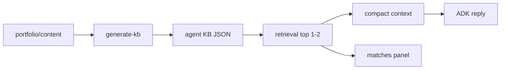

# Portfolio Agent — Architecture Roadmap

Documento canônico de evolução do agent conversacional: conhecimento derivado do portfolio, qualidade de resposta, orquestração e retrieval.

**Status:** D0–A5 + B0–B2 done.

**Fonte relacionada:** [`AGENTS.md`](../AGENTS.md) · [`.cursor/rules/`](../.cursor/rules/) · docs irmãos neste diretório.

O site editorial vive em **`portfolio/content/**`**. Este repositório consome (e, a partir de A1, gera) a KB — não é a fonte editorial.

---

## 1. Decisões travadas

| Tema | Escolha |
|------|---------|
| Fonte editorial | `portfolio/content/**` (MDX + `meta.json`) |
| KB do agent | Artefato **derivado** em `src/knowledge_base/data/` — não editar “na mão” após A1 |
| Stack | FastAPI + Google ADK + catálogo in-memory |
| Vector DB / embeddings | **Fora** desta wave (A0–A5) |
| Sessão | In-memory ADK (Redis/scale-out fora desta wave) |
| Locale operacional da KB | **en** canônico + campos `*_pt` onde a voz importa (persona/profile) |
| Fluxo HTTP | Browser → BFF `portfolio` `/api/agent/*` → este serviço (nunca browser direto) |
| Etapas | Uma por vez: D0 → A0 → … → A5 |
| Commits | Só sob pedido explícito do usuário |

Não reabrir essas decisões no meio de uma etapa. Se precisar mudar, atualize este documento e o `AGENTS.md` no mesmo PR.

---

## 2. Diagnóstico do estado atual

### O que funciona

- Camadas claras: `api/` → `orchestration/` → `adk/` + `knowledge_base/` + `tools/`
- Bootstrap em background + `/health` (`starting` / `ok` / `degraded`)
- Catálogo em memória (`lru_cache`); sem I/O por request
- Limites úteis: input sanitizado, `max_output_tokens=400`, temperature ~0.45
- Cobertura de **IDs/slugs alinhada** ao site: 6 work + 4 personal projects + 9 labs
- Deploy Cloud Run com secret + IAM (portfolio-web invoker)

### Problemas

| Problema | Evidência |
|----------|-----------|
| Duas fontes de verdade | Site em MDX rico; KB em JSON manuais — drift inevitável |
| KB rasa vs MDX | Work no site tem `decisions` / `tradeoffs` / `implementation`; KB não |
| Labs finos | `context` / `challenges` / `learnings` vazios na KB; site tem `narrative` |
| README enganoso | Fala em “embeddings / semântico”; código é Jaccard lexical + bônus de domínio |
| Retrieve duplicado | `chat_handler` sempre busca e injeta contexto; agent ainda tem tools de search |
| Conflito de instrução | “2–4 frases max” vs overview “apresente TODOS os projetos com resumo” |
| Respostas longas/genéricas | Contexto com até 4 entries + hooks de painel + overview conflictivo |
| i18n do agent incompleto | Profile/instruction montados EN-first; persona sem highlights/boundaries PT |
| Indexes subutilizados | `indexes.py` quase só para contagens no health |
| Heurísticas crescentes | Wordlists em `chat_handler` + `search.py` difíceis de manter |
| Sem testes | README cita pytest; `pyproject` só tem ruff em dev |

Detalhe de gap por slug: [`content-gap.md`](content-gap.md).  
Contrato alvo: [`knowledge-contract.md`](knowledge-contract.md).  
Política de voz: [`conversation-quality.md`](conversation-quality.md).

---

## 3. Princípios-alvo

1. **Uma fonte editorial** — MDX/meta no portfolio; KB gerada.
2. **Retrieve once** — handler busca; tools do LLM só para follow-up profundo.
3. **Contexto mínimo** — 1 primary (+ no máx. 1 related); overview não manda “listar tudo em essay”.
4. **Instruções sem conflito** — brevity e overview alinhados; few-shots do estilo desejado.
5. **Uma etapa por vez** — não misturar sync de KB com rewrite de orquestração no mesmo PR amplo.
6. **Honestidade operacional** — README e health refletem o que o código faz (lexical, não embeddings).

---

## 4. Arquitetura alvo

```text
portfolio/
└── content/                    # fonte editorial (MDX + meta)
        │
        ▼  generate-kb (A1)
portfolio-agent/
└── src/knowledge_base/data/    # artefato versionado
        │
        ▼
   retrieval (top 1–2)
        ├── compact context → ADK reply
        └── matches → painel do front
```



### Pastas (evolução, sem rewrite)

```text
src/
  knowledge_base/
    data/           # gerado (commitado)
    schema alinhado a domain/models.py + campos novos do contract
  retrieval/        # extrair search.py aqui em A4 (opcional na A3)
  conversation/     # instruction policies / few-shots (A2) — ou manter em adk/
  orchestration/    # chat_handler mais fino
  adk/              # wiring ADK
  tools/            # tools sob demanda
```

Não é obrigatório mover pastas em D0–A2; o importante é o fluxo mental acima.

---

## 5. Dependências entre fases

```text
D0 (docs)
 └─► A0 (baseline)
      ├─► A1 (sync KB) ──► A4 (retrieval rico)
      └─► A2 (style) ──► A3 (orquestração)
                           └─► A5 (testes + README)
```

- **A2** pode ajustar instruction/contexto **antes** de A1 fechar, mas a KB só é considerada “pronta” após A1.
- **A3** depois de A2 estabilizar o estilo (senão mede ruído).
- **A4** depois de A1 (dados ricos).
- **A5** fecha a wave com regressão e docs honestas.

---

## 6. Fases

### D0 — Artefatos de planejamento

**Status:** `[x]` concluída

**Objetivo:** roadmap, contratos, gap, qualidade conversacional, `AGENTS.md` e Cursor rules — espelho do E0 do portfolio.

**Escopo:**

1. Este arquivo + docs irmãos
2. `AGENTS.md` + `.cursor/rules/*`
3. Ponteiro no `portfolio/AGENTS.md` + link no README

**Done quando:**

- [x] `docs/agent-roadmap.md` completo com fases e checklists
- [x] `docs/knowledge-contract.md`, `content-gap.md`, `conversation-quality.md` existem
- [x] `AGENTS.md` + 4 Cursor rules
- [x] Ponteiro no portfolio + link no README

**Não fazer:**

- Alterar `instruction.py`, `chat_handler.py`, JSONs da KB, search, Cloud Build
- Implementar `generate-kb`
- Introduzir embeddings / Redis

---

### A0 — Baseline conversacional

**Status:** `[x]` concluída

**Objetivo:** medir o agente atual com golden queries antes de mudar comportamento.

**Escopo:**

1. Lista canônica de 10–15 queries (PT/EN) em [`conversation-quality.md`](conversation-quality.md) + [`baseline/golden-cases.json`](baseline/golden-cases.json)
2. Critérios: `response_len`, `match_ids`, anti-padrões, primary correto
3. Script [`scripts/run_baseline.py`](../scripts/run_baseline.py) + relatório em [`baseline/results/`](baseline/results/)

**Done quando:**

- [x] Golden queries documentadas e executadas uma vez (baseline anotada)
- [x] Critérios de aceite por resposta claros e compartilhados
- [x] Issues conhecidas priorizadas (estilo vs retrieval vs KB rasa) — [`baseline/issues.md`](baseline/issues.md)

**Não fazer:**

- Mudar instruction/KB “para passar” no baseline
- Adicionar embeddings

**Resultado (2026-07-22):** primary 7/8; verbosity fails em overview (2, 13) e domain denso (3); case 7 cold-start com primary errado + negação falsa; case 15 respondeu PT a query EN.

---

### A1 — Sync KB ← `content/`

**Status:** `[x]` concluída

**Objetivo:** KB gerada a partir do portfolio; fim da duplicação manual do catálogo.

**Contrato:** [`knowledge-contract.md`](knowledge-contract.md).

**Feito:**

1. `KBEntry` + `ProjectDetail` com `decisions`, `tradeoffs`, `implementation`, `narrative`
2. [`scripts/generate_kb.py`](../scripts/generate_kb.py) (`PORTFOLIO_CONTENT_DIR` / sibling `../portfolio/content`; `--check`)
3. Regenerados `projects`, `personal_projects`, `labs`, `profile`, `skills`
4. Personal: overview/highlights/features/technicalNotes mapeados
5. Labs com `narrative`; work com decisions/tradeoffs/implementation
6. `format_entry_details` + pesos lexicais nos campos novos
7. [`content-gap.md`](content-gap.md) atualizado

**Done quando:**

- [x] 19 slugs regeneráveis; `KBEntry` valida o output
- [x] Work com decisions/tradeoffs/implementation do `en.mdx`
- [x] Labs com `narrative` (4 itens) do MDX
- [x] Personal sem perda de demo/github/metrics/overview
- [x] Edição manual do catálogo desencorajada no AGENTS/README
- [x] `ai-agents-adk` mantém cold start/Cloud Run pós-sync

**Não feito (conforme plano):** persona PT (A2); ranking além do peso lexical mínimo (A4).

---

### A2 — Qualidade de resposta

**Status:** `[x]` concluída

**Objetivo:** respostas mais humanas, curtas e concretas — eliminar conflitos de prompt.

**Feito:**

1. `build_overview_context` sem “liste todos”; lista one-liner
2. `build_matches_context`: primary + 1 related (related compacto)
3. Overview browse → `_overview_reply` determinístico (evita essays do LLM)
4. Instruction com HARD LIMITS + few-shots; profile por `response_lang`
5. Persona PT; hooks de painel removidos; `about_pt` no profile
6. `max_output_tokens=256`; âncora de idioma na mensagem; fix detect (`me` ≠ PT)
7. Baseline re-rodado: verbosity/lang/anti-pattern **0** fails; case 7 fica A4

**Done quando:**

- [x] Instruction e `build_overview_context` alinhados à política de brevity
- [x] Respostas baseline sem listagens forçadas / genéricos de domínio (overview)
- [x] Persona com campos PT necessários
- [x] Golden queries A2 de estilo passam (2, 3, 6, 9, 13, 15)

**Não feito (conforme plano):** primary cold-start (A4); orquestração de tools (A3).

---

### A3 — Orquestração

**Status:** `[x]` concluída

**Objetivo:** turno previsível — retrieve once; tools só sob demanda.

**Feito:**

1. [`docs/orchestration.md`](orchestration.md) — política intent → matches → tools
2. [`hints.py`](../src/orchestration/hints.py) + [`intent.py`](../src/orchestration/intent.py); `classify_intent`
3. Intro/boundary → `matches=[]` (case 11 sem painel de pagamento)
4. Agent tools: só `get_portfolio_item`; search/learning path ficam no handler
5. Baseline: case 11 primary null / matches vazios; overview e follow-up OK

**Done quando:**

- [x] Documentado quando tools são necessárias vs proibidas no happy path
- [x] Menos heurísticas duplicadas (hints centralizados)
- [x] Latência/comportamento estável nas golden queries de follow-up (case 9)

**Não feito (conforme plano):** cold-start ranking (A4); embeddings/Redis.

---

### A4 — Retrieval

**Status:** `[x]` done (2026-07-22)

**Objetivo:** busca lexical honesta e indexes usados de verdade; dados ricos da A1.

**Escopo:**

1. Usar `indexes.py` (domain/tag/featured) no ranking
2. Melhorar tokenização / pesos com campos novos (`decisions`, `narrative`)
3. Atualizar README: lexical, não “embeddings”
4. Avaliar falhas restantes das golden queries de retrieval

**Feito:**

1. Phrase/bigram scoring + ops conhecidas (`cold start`, `cloud run`, …) em challenges/implementation
2. Experience bonus (work +1.5 / lab −0.5) + tie-break lab→work
3. Tag boost via `get_indexes()`
4. `scripts/check_retrieval.py`; baseline primary **8/8** (case 7 → `ai-agents-adk`)
5. README lexical honesto

**Done quando:**

- [x] Primary match correto na maioria das golden queries de domínio
- [x] Indexes efetivamente usados na busca
- [x] README alinhado ao mecanismo real

**Não feito (conforme plano):** Vector DB / embeddings; pytest CI full (A5).

---

### A5 — Hardening

**Status:** `[x]` done (2026-07-22)

**Objetivo:** regressão automática e docs operacionais honestas.

**Escopo:**

1. Testes: loader/schema KB, scoring de fixtures, golden conversations (estilo)
2. `pytest` no `pyproject` + CI se aplicável
3. README: arquitetura, sync, limites, link para este roadmap
4. Marcar A0–A5 e status global

**Feito:**

1. `pytest` em `dev` + `tests/` (KB, search, intent, style heuristics)
2. `src/evaluation/style_checks.py` compartilhado com `run_baseline.py`
3. GitHub Actions: `uv run pytest` (offline; sem LLM)
4. README de testes honesto; baseline LLM permanece local/manual
5. Wave D0–A5 marcada concluída

**Done quando:**

- [x] Suite mínima verde em CI ou script local documentado
- [x] README sem claims falsos
- [x] Roadmap status atualizado (wave fechada)

**Não feito (conforme plano):** baseline Gemini no Actions; `generate_kb --check` no CI (content em outro repo); mudanças de deploy.

---

### B0 — Conversation polish

**Status:** `[x]` done (2026-07-22)

**Objetivo:** corrigir lang sticky, overview bilingue, typos de nome e truncamento pós-A5.

**Feito:**

1. `resolve_lang` + sessão `response_lang` (default **pt**; turns fracos mantêm sessão)
2. Overview PT: só títulos (sem tagline EN)
3. Intent signature (“te define”) → domain + featured work; `name_resolve` aliases/fuzzy
4. `max_output_tokens=400`; strip de abertura Claro/Sure
5. Testes: `test_lang`, `test_name_resolve`, overview/intent updates

**Não feito (B1+):** `tagline_pt` no generate_kb; embeddings.

---

### B1 — Conversation presence

**Status:** `[x]` done (2026-07-22)

**Objetivo:** menos template, persona proativa, rich markdown no chat.

**Feito:**

1. Browse só por frases explícitas; intent `recommend` → LLM + matches curados (nunca overview deterministic)
2. Persona: preferred_projects, hooks; instruction com few-shots + markdown de links
3. Context: links profile + demo/github/slug nas entries
4. Hero ChatPanel: bold, italic, lists, bare URLs, `/contact` paths
5. Testes intent/recommend; temperature 0.5

**Gaps de conteúdo (B1b):** `tagline_pt`; preencher `github_url`/`demo_url` nos work cases; opcional email no profile.

---

### B2 — Agentic chat + input focus

**Status:** `[x]` done (2026-07-22)

**Objetivo:** zerar overview determinístico residual; menos truncamento; input sem reclique.

**Feito:**

1. Removido `_overview_reply` / `overview_deterministic` — overview também via LLM + `build_overview_context`
2. Recommend antes de browse; frases browse curtas (`seus projetos`) removidas
3. `max_output_tokens=640` + `_ensure_complete_tail`
4. Hero ChatPanel: refocus input; input enabled durante loading

---

## 7. Fora de escopo (salvo pedido explícito)

- Embeddings / vector DB / “semantic search” real
- Redis ou sessão multi-instância
- Alterar o BFF/UI do portfolio além do necessário para contrato de API
- Redesign visual do chat
- Traduzir slugs de URL
- Mudanças no Cloud Build não ligadas a sync/testes

---

## 8. Checklist de manutenção

Ao concluir uma fase:

1. Marcar checkboxes e **Status** desta seção
2. Atualizar a linha **Status** no topo deste arquivo
3. Não iniciar a próxima fase no mesmo PR amplo se misturar concerns (ex.: A1 + A3)

---

## 9. Referências de código (estado pré-A1)

| Área | Paths |
|------|--------|
| Instruction | `src/adk/instruction.py`, `src/adk/agent.py` |
| Turno | `src/orchestration/chat_handler.py`, `src/adk/runtime.py` |
| KB | `src/knowledge_base/{loader,context,indexes}.py`, `data/*.json` |
| Search | `src/tools/search.py`, `src/tools/portfolio_tools.py` |
| Models | `src/domain/models.py` |
